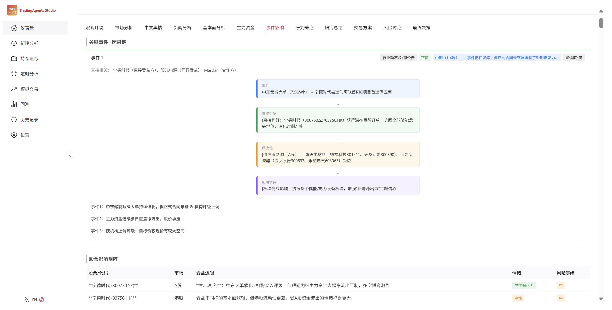
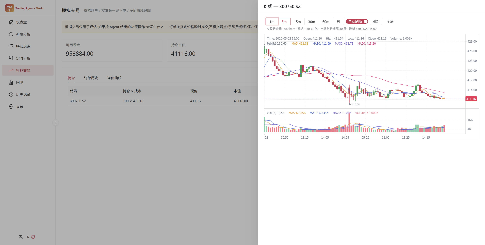

# TradingV

> **可视化多智能体 LLM 交易研究平台 — 看见 Agent 怎么想、怎么辩、怎么决策,而不是只看最后一个 BUY/SELL。**
>
> *A visual multi-agent LLM trading research workbench. Watch the agents debate, see the causal chain unfold, replay history with one click.*

[](LICENSE)
[](https://www.python.org/)
[](https://vuejs.org/)
[](https://fastapi.tiangolo.com/)

**English** | [简体中文](README.zh-CN.md)

> ⚠️ Research / educational tool only. **Not investment advice.** [Full disclaimer ↓](#disclaimer--完整免责声明)

---

<!-- TODO: Hero screenshot here. Recommended:
     - Analysis Progress page mid-run (debate bubbles streaming live)
     - Or a 30s GIF: NL input → parse → analyse → debate → decision card
     Suggested path: assets/screenshots/hero.png -->

<!-- screenshot:hero -->

---

## ✨ What makes Studio different

### 🎯 See the reasoning, not walls of text

Most LLM trading frameworks dump long Markdown reports and expect you to scroll.
Studio **parses the same reports** into structured visualisations.

- **Causal-chain cards** — the event analyst's output becomes per-event cards:
  `event → direct impact → supply chain → sector sentiment → individual stocks`,
  rendered as a vertical chain with sentiment-tinted borders.

  
- **Bull / Bear as a dialogue** — no more two long blocks of text.
  Left/right chat bubbles split by round, role-tagged, with a live-pulse on
  the freshest turn. Risk debate (aggressive / conservative / neutral) gets
  the same treatment in three colours.
  <!-- screenshot:debate-bubbles -->
- **Streamed live** — the progress page subscribes to a `debate_turn` event
  over WebSocket and grows the dialogue **in real time** as the graph runs —
  not just "node X completed" timeline ticks.

### 🇨🇳 A-share as a first-class citizen

Built for Chinese-market research from the data layer up, while keeping
full US / HK / global coverage.

- **AKShare** (free, default) + **Tushare Pro** (optional paid fallback) —
  the vendor router **auto-detects A-share tickers** (`6-digit`, `.SS/.SH/.SZ`,
  `sh/sz` prefix) and routes them through the CN chain. No config flip.
- **4 A-share-native analysts**:
  - `cn_social` — 东方财富股吧 retail discussion (HTTP-only, no credentials)
    + optional 微博/小红书/抖音 via [MediaCrawler](https://github.com/NanmiCoder/MediaCrawler)
  - `event` — LLM-reasoned causal chains, no keyword dictionary
  - `capital_flow` — 主力资金净流入 / 北向(沪深港通) / 融资融券 / 龙虎榜
  - `macro` — top-down regime read (CPI/PPI/M2/PMI/LPR/USDCNY/US 10Y)
    mapped to sector tilts
- **Minute-level K-line** for A-share (1/5/15/30/60-min via AKShare),
  live-refresh every 30–60s during trading hours.

### 🛠 Complete workflow, not just one-shot inference

Studio bundles the muscles a research workbench actually needs:

| Feature | What it does |
|---|---|
| **Natural-language entry** | "研究茅台短期" / "AAPL 30 天" → ticker + date + period auto-filled. Rule-based first (deterministic, free), optional LLM fallback. |
| **Holdings tracking** | A-share / global positions with shares, cost, real-time quote, P&L, and **latest analysis signal per ticker**. CSV import accepts 代码/股数/成本价 Chinese headers. |
| **Scheduled analyses** | Interval / daily / weekly background runs. Analyst + LLM config snapshotted at create time. Auto-disable after 3 consecutive failures so a broken setup can't silently burn through your quota. |
| **Paper trading** | Virtual account, cash, positions, daily NAV snapshots. **One-click "按此决策模拟下单"** parses the trader proposal's Action + Entry/Target/Stop and opens a virtual position. Enforces A-share T+1. |
| **决策回放回测 (Decision Replay)** | Event-driven backtest replays Studio's stored Agent decisions over any window — answers *"if I'd followed the agents' Buy/Sell calls, what would my net worth look like?"*. **Zero LLM cost** since it replays history. Reports total return, max drawdown, Sharpe, Sortino, win rate, profit factor, alpha vs benchmark. Each trade links back to its source analysis report. |
| **决策质量看板 (Decision Quality)** | The next step after backtest. Scores **every individual completed analysis** against real N-day price moves (5 / 30 / 60-day horizons), benchmarked against the regional index. Surfaces overall win-rate / avg α / Sharpe, a **confidence-calibration curve** (does "0.8 confidence" actually win 80%?), breakdowns by **ticker / signal / single analyst / analyst combo / LLM model** (so you can answer *"did adding `capital_flow` improve alpha?"*), and a per-day calendar heatmap. Computed on demand — no extra tables, no LLM cost. |
| **K-line panel** | Per-ticker drawer from Holdings or Paper rows. Daily + 1/5/15/30/60-min bars, MA(5/10/20) + volume overlays, optional entry/target/stop reference lines, fullscreen mode. |
| **API key & model picker** | Per-provider model catalog (e.g. DeepSeek V4 Pro / V3.2 thinking / …, Claude Opus 4.7 / Sonnet 4.6 / …). API keys editable from Settings → written through to `.env` so the CLI sees the same values. Keys masked in read path, raw never echoed. |

Everything inherited from upstream — the LangGraph workflow, multi-provider LLMs,
decision log, checkpoint resume — still works as before.

---

## 🆚 Why this fork?

| | Upstream `TradingAgents` | **TradingV** |
|---|---|---|
| **Interface** | CLI only | CLI + Web UI |
| **Market coverage** | US | US + **A-share native** + HK |
| **Agent output** | Markdown reports | **Structured visualisation** + Markdown |
| **A-share analysts** | — | `cn_social`, `event`, `capital_flow`, `macro` |
| **A-share data** | — | AKShare (free) + Tushare Pro (optional) |
| **Holdings / paper / backtest** | — | ✅ |
| **Decision-quality dashboard** | — | ✅ (win-rate / alpha / calibration per analyst combo & LLM) |
| **Scheduled analyses** | — | ✅ |
| **Natural-language input** | — | ✅ (rule-based + optional LLM) |
| **LLM providers** | OpenAI / Google / Anthropic | + DeepSeek / 通义 / 智谱 / MiniMax / OpenRouter / Ollama / Azure |

> This is an **open-source community fork**, not affiliated with Tauric Research.
> See [Upstream credits](#upstream-credits) for the original work and citation.

---

## 🚀 Quick start

### 1. Install

```bash
git clone <your-repo-url> TradingV
cd TradingV

# Recommended: virtual env
python -m venv .venv
.venv\Scripts\activate          # Windows
# source .venv/bin/activate     # Linux/macOS

# Install — pick the extras you need:
pip install -e ".[web,cn]"                    # Web UI + A-share (recommended)
# pip install -e ".[web]"                     # US-only, skip akshare/tushare
# pip install -e ".[web,cn,cn-pro,cn-social]" # + Tushare paid + 股吧/微博 sentiment
# pip install -e ".[all]"                     # everything except dev tooling
# pip install -e ".[web,cn,dev]"              # contributors (adds pytest)
```

### 2. Configure API keys

```bash
cp .env.example .env
# Edit .env: set at least ONE LLM provider's key.
# Data-source keys (TUSHARE_TOKEN / ALPHA_VANTAGE_API_KEY) are all optional —
# the pipeline runs entirely on free sources by default.
```

You can also manage LLM API keys **from the Web Studio's Settings page** —
values are written through to `.env` so the CLI sees the same keys.

### 3. Run

**Web Studio (recommended):**

```bash
# Start both backend and frontend (prefers uv for Python env)
scripts/start.sh all

# Or start them separately
scripts/start.sh backend   # http://127.0.0.1:8000
scripts/start.sh frontend  # http://localhost:3000
```

For production single-process deployment, build the frontend once and let
the backend serve the static bundle:

```bash
cd web/frontend && npm run build
cd ../..
tradingagents-web              # serves the built UI at http://127.0.0.1:8000/
```

**CLI:**

```bash
tradingagents
```

**Docker (CLI workflow):**

```bash
cp .env.example .env
docker compose run --rm tradingagents
```

> The Docker image targets the CLI workflow. To run the Web Studio under
> Docker, expose port `8000` and build the frontend before container start.

---

## 🎬 Try it out — typical flow

1. Open `http://localhost:3000/`.
2. **Settings** → fill in your `DEEPSEEK_API_KEY` (or any LLM provider's key).
3. **新建分析** → type `研究茅台短期` in the smart-parse box → click 解析并填充 → ticker `600519`, date today, all set.
4. Pick analyst team — check `Event` for the causal-chain output and `CN Sentiment` for 股吧 — start.
5. On the **Analysis Progress** page, the right side grows a live debate transcript between Bull and Bear as rounds complete.
6. On the **Report Detail** page open the `事件影响` tab — per-event cards with arrows showing event → impact → supply chain → sector → individual stocks (instead of a wall of Markdown).
7. Add the ticker to **持仓追踪** with shares + cost. The Holdings page shows real-time price, P&L, and links to the latest analysis signal.
8. From **模拟交易** open the K-line drawer for any held ticker — daily + 1/5/15/30/60-min bars with MA(5/10/20), volume, and entry/target/stop overlays from the decision card.



---

## 💰 Cost & speed estimates

A single complete analysis (4 analysts + 1 debate round, ~5–10K input tokens
+ ~3–5K output tokens) typically costs and takes:

| LLM | Single-run cost | Time | Notes |
|---|---|---|---|
| **DeepSeek V4 Pro** | ~¥0.05 | ~45s | Best price/quality for CN |
| **Qwen Plus** (DashScope) | ~¥0.10 | ~50s | Strong CN context, A-share-savvy |
| **GLM-4.6** | ~¥0.15 | ~40s | Decent reasoning, lower cost |
| **Claude Sonnet 4.6** | ~$0.20 | ~40s | Strongest structured output |
| **GPT-5.4** | ~$0.30 | ~30s | Fastest among premium |
| **Ollama (local)** | Free | varies | Quality depends on model + hardware |

> Numbers are rough estimates from typical Studio runs; your usage will vary
> with analyst count, debate rounds, and report length. **All Studio data
> sources are free** — paid keys (Tushare, Alpha Vantage) are optional.

---

## 🏛 Architecture

```
                 ┌────────────────────────────────────────────────────────┐
                 │             TradingAgentsGraph (LangGraph)             │
                 │                                                        │
   selected ───► │  Analysts ─► Researchers ─► Trader ─► Risk ─► Portfolio│
   analysts      │  market                    (debate)  (debate) Manager  │
                 │  social                                                │
                 │  news                                                  │
                 │  fundamentals                                          │
                 │  cn_social   ← Studio (A-share)                        │
                 │  event       ← Studio (LLM causal chain)               │
                 │  capital_flow← Studio (主力资金 / 北向 / 龙虎榜)        │
                 │  macro       ← Studio (CPI/PPI/M2/PMI/LPR)             │
                 └────────────────────────────────────────────────────────┘
                                          ▲
                                          │  WebSocket: agent_complete + debate_turn
                                          │
                 ┌────────────────────────────────────────────────────────┐
                 │   Web Studio                                            │
                 │   FastAPI ◄─► SQLite  │  Vue 3 + Naive UI frontend     │
                 │                                                        │
                 │   ▸ Natural-language analyze entry                     │
                 │   ▸ Causal-chain + debate-bubble visualisation         │
                 │   ▸ Holdings tracking (real-time quote, latest signal) │
                 │   ▸ Scheduled analyses (interval / daily / weekly)     │
                 │   ▸ Paper trading (from-decision orders, NAV curve)    │
                 │   ▸ K-line panel (daily + 1/5/15/30/60-min, live)      │
                 │   ▸ Decision Replay backtest                           │
                 │   ▸ API-key + model-catalog management                 │
                 └────────────────────────────────────────────────────────┘
                                          ▲
                                          │  vendor router auto-routes A-share
                                          │  → akshare → tushare → yfinance
                 ┌────────────────────────────────────────────────────────┐
                 │   Data sources                                          │
                 │   AKShare  · Tushare · yfinance · Alpha Vantage         │
                 │   东方财富股吧 · Reddit · StockTwits · MediaCrawler    │
                 └────────────────────────────────────────────────────────┘
```

---

## 📡 Data sources

The Studio routes data requests through `tradingagents/dataflows/interface.py:route_to_vendor`,
which auto-detects A-share tickers and falls back across vendors on failure.

### Stock prices / fundamentals / news

| Source | Coverage | Cost | Setup |
|---|---|---|---|
| **AKShare** | A-share OHLCV / fundamentals / news | Free | No key needed (default for A-share) |
| **Tushare Pro** | A-share OHLCV / fundamentals | Free tier (rate-limited) + paid | Set `TUSHARE_TOKEN` |
| **yfinance** | US / HK / TYO / global | Free | No key needed |
| **Alpha Vantage** | US prices / fundamentals / news / insider | 25 req/day free, paid above | Set `ALPHA_VANTAGE_API_KEY` (optional) |

### Sentiment

| Source | Coverage | Cost | Setup |
|---|---|---|---|
| **东方财富股吧** | A-share retail discussion | Free | HTTP-only |
| **MediaCrawler** | 微博 / 小红书 / 抖音 | Free (self-host) | Optional — needs MySQL + [MediaCrawler](https://github.com/NanmiCoder/MediaCrawler) running separately |
| **Reddit** | US tickers, r/wallstreetbets etc. | Free | — |
| **StockTwits** | US trader community | Free | — |

> **You can run the entire pipeline with only free sources.** Tushare and
> Alpha Vantage keys are optional; if not configured the vendor router
> simply skips them.

---

## 🐍 Programmatic usage

```python
from tradingagents.graph.trading_graph import TradingAgentsGraph
from tradingagents.default_config import DEFAULT_CONFIG

config = DEFAULT_CONFIG.copy()
config["llm_provider"] = "deepseek"
config["deep_think_llm"] = "deepseek-v4-pro"
config["quick_think_llm"] = "deepseek-v4-flash"
config["max_debate_rounds"] = 2

ta = TradingAgentsGraph(
    selected_analysts=["market", "cn_social", "event", "news", "fundamentals"],
    config=config,
)
_, decision = ta.propagate("贵州茅台", "2026-01-15")  # or "600519"
print(decision)
```

A-share tickers are auto-routed through AKShare → Tushare → yfinance regardless
of the global `data_vendors` setting. See [`tradingagents/default_config.py`](tradingagents/default_config.py)
for the `cn_data_vendors` chain.

See [`examples/quickstart.py`](examples/quickstart.py) for a minimal runnable.

---

## 💾 Persistence & recovery

### Decision log

Always on. Each completed run appends its decision to `~/.tradingagents/memory/trading_memory.md`.
On the next run for the same ticker, the framework injects the most recent
decisions and realised-return reflections into the Portfolio Manager prompt.
Override the path with `TRADINGAGENTS_MEMORY_LOG_PATH`.

### Checkpoint resume

Opt-in via `--checkpoint`. LangGraph saves state after each node so a crashed
run resumes from the last successful step. Per-ticker SQLite databases live
at `~/.tradingagents/cache/checkpoints/<TICKER>.db`.

### Web state

The Web Studio's SQLite (runs, holdings, schedules, paper account, backtests)
lives at `~/.tradingagents/web_state.db`. Override with `TRADINGAGENTS_WEB_DB`.
**It is recreated automatically on startup if missing** — deleting it just
gives you a clean slate. API keys live in `.env`, not in this database.

---

## 🧰 Tech stack

**Core (Python):** Python 3.10+ · LangChain + LangGraph · Pydantic · AKShare / Tushare / yfinance / Alpha Vantage · beautifulsoup4 + lxml (股吧 HTML) · pymysql (MediaCrawler, optional) · stockstats · backtrader · Rich + Typer

**Web backend:** FastAPI + Uvicorn · WebSockets · SQLite

**Web frontend:** Vue 3 + TypeScript + Vite · Naive UI · Pinia · Vue Router · Chart.js + vue-chartjs · klinecharts · marked · axios

**LLM providers:** OpenAI · Google Gemini · Anthropic Claude · xAI Grok · DeepSeek · Qwen (DashScope intl + CN) · GLM (Z.AI + BigModel) · MiniMax (global + CN) · OpenRouter · Ollama · Azure OpenAI

---

## 🗺 Roadmap

- [ ] **Phase 2 Backtest** — live Agent inference replay (re-call the LLM per bar) for true forward-looking backtests
- [ ] Futures (期货) and HK market data adapters
- [ ] Multi-account paper trading
- [ ] Decision-card → real broker sandbox API bridge
- [ ] Responsive / mobile-friendly UI
- [ ] GitHub Actions CI (`pytest -m unit` on PR)
- [ ] Public Discussions / Issue templates

Have a suggestion? Open an issue or start a Discussion — feedback shapes the roadmap.

---

## 🤝 Contributing

Issues / PRs welcome. Before submitting a PR:

1. Run unit tests: `pytest -m unit`
2. If you change LangGraph orchestration or schema, update `CHANGELOG.md`'s
   `[Unreleased]` section
3. If you modify a file inherited from upstream, add a `"Modified by"`
   notice (Apache 2.0 §4(b) — see existing files for the format)

For end-to-end verification against a real LLM provider (new provider
adapters, structured-output changes), use:

```bash
DEEPSEEK_API_KEY=... python scripts/smoke_structured_output.py deepseek
```

---

## 🌐 Community

This project is shared and discussed on the following community:

- [LINUX DO](https://linux.do/) — a real tech community.

Feedback, issues, and suggestions are welcome there.

---

## 📁 Project layout

```
tradingagents/                  # core agent framework (inherited + extended)
├── agents/
│   ├── analysts/               # + cn_sentiment_analyst.py, event_analyst.py
│   │                           # + capital_flow_analyst.py, macro_analyst.py
│   ├── researchers/            # bull / bear (extended for CN reports)
│   ├── managers/               # research manager, portfolio manager
│   ├── trader/
│   └── risk_mgmt/
├── backtesting/                # Studio — event-driven backtest engine
│   ├── engine.py
│   ├── portfolio.py
│   ├── metrics.py
│   ├── slippage.py
│   └── signals/                # signal sources (memory_log, future: rule / live_agent)
├── dataflows/                  # data-fetching layer
│   ├── _proxy.py               # Studio — NO_PROXY bootstrap for CN data domains
│   ├── akshare_stock.py        # Studio — A-share market data
│   ├── tushare_stock.py        # Studio — A-share paid-grade fallback
│   ├── cn_sentiment.py         # Studio — A-share sentiment aggregator
│   ├── eastmoney_guba.py       # Studio — 东方财富股吧 client
│   ├── mediacrawler_wrapper.py # Studio — MySQL wrapper for MediaCrawler
│   ├── event_intelligence.py   # Studio — event/causal-chain helpers
│   ├── capital_flow.py         # Studio — 主力资金 / 北向 / 龙虎榜 / 两融
│   ├── macro.py                # Studio — CPI/PPI/M2/PMI/LPR/USDCNY/10Y
│   └── ...
├── graph/                      # LangGraph orchestration
├── llm_clients/                # multi-provider LLM factory
└── utils/
    └── nl_query_parser.py      # Studio — "研究茅台短期" parser

web/                            # Web Studio
├── backend/                    # FastAPI + SQLite + WebSocket
│   ├── main.py
│   ├── database.py             # runs · events · reports · holdings ·
│   │                           # schedules · paper_accounts/positions/orders/nav
│   ├── graph_runner.py         # emits agent_complete + debate_turn events
│   ├── scheduler.py            # Studio — recurring-analysis asyncio loop
│   └── routers/
│       ├── analyze.py          # incl. POST /api/parse-query
│       ├── history.py
│       ├── dashboard.py
│       ├── holdings.py         # holdings CRUD + CSV import + quote
│       ├── schedule.py         # Studio — schedule CRUD + trigger + bulk-from-holdings
│       ├── paper.py            # Studio — paper trading
│       ├── quote.py            # Studio — K-line OHLC (daily + intraday)
│       ├── backtest.py         # Studio — backtest runs / curve / trades
│       └── settings.py         # incl. /api/api-keys + /api/model-catalog
└── frontend/                   # Vue 3 + Naive UI + Pinia + Vite
    └── src/
        ├── components/
        │   ├── EventReport.vue       # causal-chain visualisation
        │   ├── CausalChain.vue
        │   ├── DebateThread.vue      # bull/bear bubble dialogue
        │   ├── ModelPicker.vue       # per-provider model dropdown
        │   └── KLineChart.vue        # Studio — klinecharts panel
        └── pages/                    # Dashboard · NewAnalysis · Holdings ·
                                       # Schedule · Paper · Backtest ·
                                       # AnalysisProgress · History ·
                                       # ReportDetail · Settings

cli/                            # Typer-based CLI (inherited)
examples/                       # Minimal Python entry-point examples
scripts/                        # Real-LLM smoke tests (manual, costs $$$)
tests/                          # 22 files, 248 test cases
```

---

## ⭐ Show your support

If Studio is useful to your research, **star this repo** — it helps others
find it and motivates continued development.

<!-- Optional: WeChat group QR. Drop the image at assets/screenshots/wechat.png:
<p align="center">
  
</p>
-->

---

## 📜 License

Licensed under the **Apache License 2.0**, identical to the upstream project.
See [`LICENSE`](LICENSE).

Per Apache 2.0 §4(b), source files modified relative to upstream carry a
"Modified by" notice. New files added by this fork carry their own copyright
notice and remain under Apache 2.0.

---

## Upstream credits

This project is derivative work based on the open-source framework
**TradingAgents** by Tauric Research. Please support and cite the original work:

- Upstream repository: [github.com/TauricResearch/TradingAgents](https://github.com/TauricResearch/TradingAgents)
- Paper: Xiao, Y., Sun, E., Luo, D., & Wang, W. (2025). *TradingAgents: Multi-Agents LLM Financial Trading Framework*. [arXiv:2412.20138](https://arxiv.org/abs/2412.20138)

```bibtex
@misc{xiao2025tradingagentsmultiagentsllmfinancial,
      title={TradingAgents: Multi-Agents LLM Financial Trading Framework},
      author={Yijia Xiao and Edward Sun and Di Luo and Wei Wang},
      year={2025},
      eprint={2412.20138},
      archivePrefix={arXiv},
      primaryClass={q-fin.TR},
      url={https://arxiv.org/abs/2412.20138}
}
```

> This project is **not affiliated with, endorsed by, or sponsored by Tauric Research**.
> "TradingAgents" is the upstream project name; this fork is published under
> a derivative name to avoid confusion. All trademark rights to the original
> project name belong to their respective owners.
>
> Third-party libraries used by this fork retain their respective licenses.
> The MediaCrawler integration calls a separately-installed external project;
> please review and comply with the licensing and terms-of-service of any
> data source you crawl.

Changes from upstream are documented in [`CHANGELOG.md`](CHANGELOG.md).

---

## Disclaimer / 完整免责声明

### English

TradingV is intended for **research, education, and personal
experimentation only**. It is **NOT** financial, investment, or trading advice.

- The project does **not recommend any stock or security**. The outputs of
  LLM-based agents — including any "Buy / Sell / Hold" signal, target price,
  stop-loss level, or confidence score — are the product of multi-agent
  algorithmic debate, **not** an investment opinion of the authors,
  contributors, or any institution.
- LLM outputs may be inaccurate, incomplete, biased, or otherwise misleading.
  **Markets involve substantial risk of loss.**
- You are **solely responsible** for any decisions made using this software,
  and for any resulting financial outcome.
- This project must **not** be used to provide investment advisory services,
  stock recommendations, or asset management to the public, whether for free
  or for a fee.

### 中文

TradingV 仅供 **研究、教育、个人学习与技术演示** 使用,
**不构成任何形式的投资、财务或交易建议**。

- 本项目 **不推荐任何股票或证券**。Agent 输出的"买入 / 卖出 / 持有"信号、目标价、
  止损价、置信度等字段,均为多智能体算法辩论的中间产物,
  **不代表作者、贡献者或任何机构的投资观点**。
- LLM 输出可能存在错误、不完整、偏见或误导。**证券市场有风险,投资需谨慎。**
- 任何依据本项目输出做出的投资决策及其后果,**均由使用者本人承担**,
  与作者、贡献者及任何关联方无关。
- 禁止将本项目用于面向公众的投资咨询、荐股、代客理财、私募/公募基金运作等行为,
  无论是否收费。
